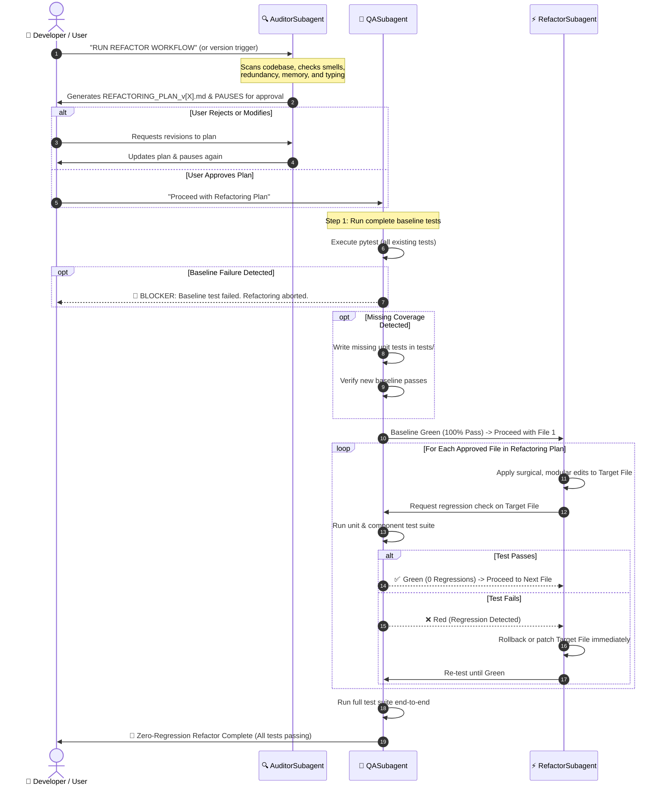

# 🔄 RefactorAndQAPipeline: Multi-Subagent Refactoring & QA Engine

> **Workflow Objective**: Safely audit, test, and optimize the codebase on-demand (after major feature updates, version releases, or scraper enhancements) using a closed-loop multi-subagent team with strict zero-regression guarantees.

---

## 📑 Table of Contents
- [1. Workflow Trigger & Commands](#1-workflow-trigger--commands)
- [2. Multi-Subagent Setup & Roles](#2-multi-subagent-setup--roles)
  - [🔍 AuditorSubagent](#-auditorsubagent)
  - [🧪 QASubagent](#-qasubagent)
  - [⚡ RefactorSubagent](#-refactorsubagent)
- [3. End-to-End Orchestration Flow](#3-end-to-end-orchestration-flow)
- [4. Operational Execution Protocol](#4-operational-execution-protocol)
  - [Phase 1: Code Health Audit & Plan Formulation](#phase-1-code-health-audit--plan-formulation)
  - [Phase 2: Human-in-the-Loop Approval Gate (Mandatory Pause)](#phase-2-human-in-the-loop-approval-gate-mandatory-pause)
  - [Phase 3: Baseline QA Gate & Missing Test Generation](#phase-3-baseline-qa-gate--missing-test-generation)
  - [Phase 4: Atomic Refactoring & QA Verification Loop](#phase-4-atomic-refactoring--qa-verification-loop)
  - [Phase 5: Final Sanity Check & Deliverable Summary](#phase-5-final-sanity-check--deliverable-summary)
- [5. Zero-Regression Invariant & Safety Guardrails](#5-zero-regression-invariant--safety-guardrails)
  - [5.1 The 6 Non-Negotiable Zero-Regression Rules](#51-the-6-non-negotiable-zero-regression-rules)
  - [5.2 Emergency Auto-Rollback Protocol](#52-emergency-auto-rollback-protocol)
  - [5.3 Dual-Workspace Mirroring & Parity Invariant](#53-dual-workspace-mirroring--parity-invariant)

---

## 1. Workflow Trigger & Commands

This workflow is registered for on-demand execution. Any of the following command prompts typed into Antigravity will initiate the pipeline:

```text
RUN REFACTOR WORKFLOW
```
```text
Run RefactorAndQAPipeline for version [version / feature-name]
```

---

## 2. Multi-Subagent Setup & Roles

The pipeline coordinates three specialized subagent personas working in a closed, feedback-driven loop:

```
+-----------------------------------------------------------------------------------+
|                           RefactorAndQAPipeline                                   |
+-----------------------------------------------------------------------------------+
|                                                                                   |
|  [ Step 1: Scan & Audit ]           [ Step 2: Quality Gate ]     [ Step 3: Loop ] |
|                                                                                   |
|    🔍 AuditorSubagent      ⏸️               🧪 QASubagent     <=======>  ⚡ RefactorSubagent
|   - Scans smells & debt   PAUSE           - Runs pytest suite       Atomic  - Applies fixes
|   - Generates plan        Human Approval  - Generates tests        Verify   - Preserves API
|   - Outputs MD draft      Required!       - Blocks failures                 - Triggers QA
|                                                                                   |
+-----------------------------------------------------------------------------------+
```

---

### 🔍 AuditorSubagent

- **Role**: Principal Code Health Auditor & Software Architect
- **Mission**: Thoroughly inspect recent code additions, modules, schemas, and UI components to detect technical debt, code smells, redundancies, and performance bottlenecks without altering any source code.
- **Capabilities**:
  - Scans Python modules for:
    - Dead code, unused functions, and redundant imports.
    - Code duplication across scrapers (`src/agents/scrapers/`), parsers, and matching logic.
    - Unguarded dictionary key accesses (preventing runtime `KeyError` regressions).
    - Unhandled exceptions and silent error suppressions.
    - Inconsistent type annotations or missing Pydantic schema alignments.
    - Memory bottlenecks or unclosed file/network buffers.
  - Formulates an actionable, prioritized markdown proposal named:  
    `REFACTORING_PLAN_v[X].md` *(where `[X]` corresponds to the target version or current ISO date)*.
  - **MANDATORY PROTOCOL**: **Must PAUSE** execution and request explicit user confirmation before any modifications are started.

---

### 🧪 QASubagent

- **Role**: Lead QA Engineer & Test Automation Specialist
- **Mission**: Guarantee complete test coverage and enforce a zero-regression invariant across unit, integration, and UI component layers.
- **Capabilities**:
  - Executes existing pytest suite via terminal:
    ```powershell
    .\.venv\Scripts\python.exe -m pytest -v --tb=short
    ```
  - Analyzes test coverage against newly modified or untracked modules.
  - Automatically writes new mock-safe unit tests in `tests/` if new features or functions lack coverage.
  - Validates Streamlit UI component resilience (e.g., verifying that dialogs and cards tolerate empty, null, or malformed data dictionaries).
  - **BLOCKER GATE**: If any baseline test fails, **all refactoring is immediately blocked** until the baseline failure is diagnosed and resolved.

---

### ⚡ RefactorSubagent

- **Role**: Senior Refactoring & Optimization Specialist
- **Mission**: Execute the user-approved refactoring items one file at a time, enforcing clean architectural patterns, documentation integrity, and backward compatibility.
- **Capabilities**:
  - Implements approved modular refactors using surgical, contiguous edits.
  - Preserves all docstrings, comments, type signatures, and external API contracts.
  - Eliminates duplicate helpers by centralizing shared logic into utilities (`src/utils/`).
  - **VERIFICATION PROTOCOL**: After updating **every single file**, immediately calls `QASubagent` to run relevant test suites.
  - **ROLLBACK PROTOCOL**: If a test fails after an edit, immediately rolls back the file change or fixes the issue before touching any subsequent files.

---

## 3. End-to-End Orchestration Flow



---

## 4. Operational Execution Protocol

When Antigravity receives the trigger command, it executes the following five phases:

### Phase 1: Code Health Audit & Plan Formulation
1. **Scope Determination**: Determine whether a specific version tag or feature scope was passed (e.g. `version 1.1`, `Portuguese Scrapers`, or full app).
2. **Audit Execution**:
   - Inspect files under `src/agents/`, `src/utils/`, `src/views/`, and `src/schemas.py`.
   - Identify:
     - Dead code paths or unreferenced variables.
     - Uncached expensive function calls or repetitive regex compilations.
     - Unsafe dictionary accesses missing `.get()` fallbacks.
     - Duplicate logic across scrapers or formatting functions.
3. **Plan Generation**:
   Create a draft file in the project root named:
   `REFACTORING_PLAN_v[X].md`
   The plan must include:
   - Executive Summary of discovered technical debt.
   - Categorized optimization items (P0: Reliability/Bugs, P1: Performance/Deduplication, P2: Style/Typing).
   - Targeted files and exact proposed refactoring strategy.
   - Associated test files that validate each target.

---

### Phase 2: Human-in-the-Loop Approval Gate (Mandatory Pause)
1. **Antigravity stops calling tools** and presents the summary of `REFACTORING_PLAN_v[X].md` directly to the user.
2. Prompts the user:
   > *"I have generated the refactoring plan in `REFACTORING_PLAN_v[X].md`. Please review the proposed changes. Reply with **'Proceed'** to execute the refactoring and QA loop, or specify any modifications/exclusions."*
3. **Antigravity MUST NOT make code modifications until explicit user approval is received.**

---

### Phase 3: Baseline QA Gate & Missing Test Generation
1. Once approval is granted, `QASubagent` executes the existing test suite:
   ```powershell
   .\.venv\Scripts\python.exe -m pytest
   ```
2. **Verify Baseline**:
   - If tests fail prior to any changes: Halt and notify the user with the failure log.
3. **Supplement Missing Tests**:
   - If a target module has 0% coverage, author a new unit test in `tests/test_<module_name>.py` covering standard, edge-case, and empty inputs.
   - Run pytest to verify the new test passes against existing functionality before refactoring begins.

---

### Phase 4: Atomic Refactoring & QA Verification Loop
For each item in the approved plan:
1. `RefactorSubagent` edits **one file at a time**.
2. Immediately triggers `QASubagent`:
   ```powershell
   .\.venv\Scripts\python.exe -m pytest tests/test_<relevant_suite>.py
   ```
3. If the suite passes:
   - Mark the item as completed in `REFACTORING_PLAN_v[X].md`.
   - Advance to the next approved file.
4. If the suite fails:
   - Analyze the diff and error traceback.
   - Adjust the implementation or restore the original code before proceeding.

---

### Phase 5: Final Sanity Check & Deliverable Summary
1. Run the entire comprehensive test suite across the repository:
   ```powershell
   .\.venv\Scripts\python.exe -m pytest
   ```
2. Update `REFACTORING_PLAN_v[X].md` with:
   - Final status of each task (`[x] Completed`).
   - Summary of test results (e.g. `127 passed in 28.5s`).
   - Metrics improved (lines removed, duplicate helpers consolidated, latency reduced).
3. Report the completion summary to the user.

---

## 5. Zero-Regression Invariant & Safety Guardrails

The primary objective of the `RefactorAndQAPipeline` is codebase health and optimization with **ZERO regressions**. An optimization that breaks a caller, alters a subtle data type, or causes an edge-case test failure is strictly considered a defect and must never be committed.

### 5.1 The 6 Non-Negotiable Zero-Regression Rules

1. **Rule 1: Baseline Invariance (Green-to-Green)**
   - Prior to modifying a single line of code in Phase 4, the entire repository test suite must pass with 0 failures and 0 errors:
     ```powershell
     .\.venv\Scripts\python.exe -m pytest -q
     ```
   - If any existing test fails before refactoring begins, execution halts immediately. Refactoring broken code is strictly prohibited.

2. **Rule 2: Atomic, Single-File Mutation**
   - Refactor operations must occur strictly **one file at a time**.
   - Batch edits across multiple independent modules without intermediate automated test runs are disallowed.
   - After editing file $N$, the corresponding unit test suite must be triggered and confirmed 100% passing before file $N+1$ is touched.

3. **Rule 3: Strict API Contract & Data Dictionary Parity**
   - Public function signatures, module exports (`__all__`), class constructors, return types, and dictionary key schemas (`job["profile_fit_score"]`, `job["strategic_decision"]`) must remain 100% backward compatible.
   - If an internal representation changes, callers and consumers (such as Streamlit UI views and state serializations) must be updated simultaneously in the same atomic transaction.

4. **Rule 4: Zero-Warning Hygiene**
   - Pytest runs must be clean of unmanaged deprecation warnings or syntax warnings. Warning filters must be explicitly configured in `pytest.ini` for upstream third-party SDK quirks (e.g. Google GenAI SDK type alias warnings on Python 3.14+).

5. **Rule 5: Comprehensive Coverage Expansion**
   - Refactoring must never decrease total test count. If new modules, scrapers, or helpers are introduced or refactored, the test count must either increase or remain identical. Discoverability of all `test_*.py` files in `tests/` must be verified.

6. **Rule 6: Multi-User Data Isolation Protection**
   - The refactoring pipeline must NEVER modify, overwrite, delete, or reformat user files under `data/users/` or root configuration files (`.env`). Candidate workspace states are immutable to refactoring runs.

---

### 5.2 Emergency Auto-Rollback Protocol

If `QASubagent` reports a test failure or runtime regression during Phase 4:
1. **Immediate Execution Freeze**: `RefactorSubagent` halts all further modifications.
2. **Failure Triage**: The subagent inspects the pytest failure log and AST diff.
3. **5-Minute Fix or Revert Rule**:
   - If the root cause is a simple missing import or syntax fix, apply it immediately and re-run pytest.
   - If the fix is non-trivial or alters component contracts, immediately revert the file to its pre-refactor state:
     ```powershell
     git checkout -- <modified_file_path>
     ```
4. **Re-establish Green State**: Confirm full test pass before proceeding to subsequent tasks.

---

### 5.3 Dual-Workspace Mirroring & Parity Invariant

When working across multiple repositories or version directories (e.g., `job_search_app_hyrd` and `job_search_app_hyrd_v2`):
- All refactored modules, centralized utilities, test improvements, and configuration files (`pytest.ini`) must be mirrored across both project workspaces.
- Automated tests must be executed independently in each environment's virtual environment:
  ```powershell
  # Primary Workspace
  c:\Users\david\OneDrive\Desktop\job_search_app_hyrd\.venv\Scripts\python.exe -m pytest
  
  # Version 2 Workspace
  c:\Users\david\OneDrive\Desktop\job_search_app_hyrd_v2\.venv\Scripts\python.exe -m pytest
  ```
- Both workspaces must achieve an identical **100% test pass rate** (131 passed, 0 failures).

---

<div align="center">
  <strong>RefactorAndQAPipeline</strong> • Continuous Code Quality & Regression Protection<br>
  <em>Part of the Autonomous Multi-Agent Engineering Architecture</em>
</div>
