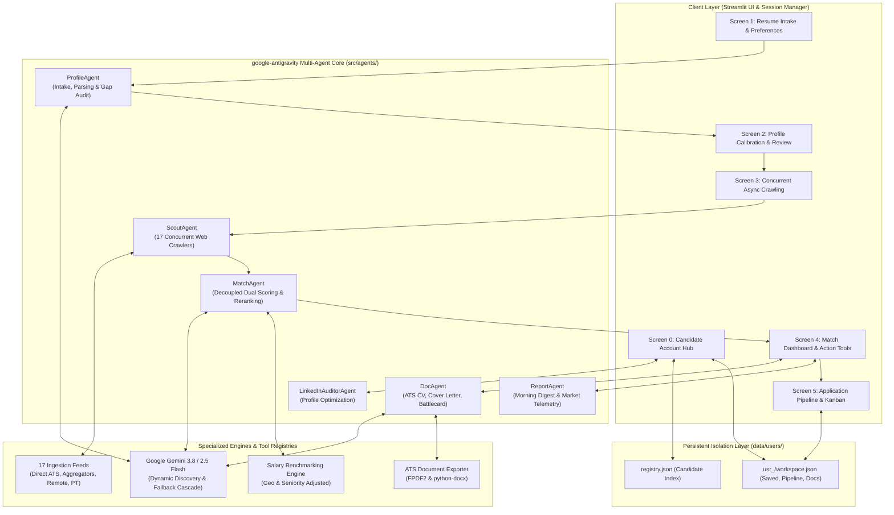
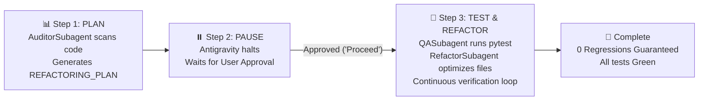

# ⚡ Hyrd — Autonomous Multi-Agent Career Platform
## Official User Guide & Comprehensive Technical Manual
> **Tagline**: *Don't just search. Get Hyrd!*  
> **Framework**: `google-antigravity` Multi-Agent Architecture & Google Gemini AI  
> **Documentation Version**: 4.0.0 (Production Release)  
> **Author**: Antigravity Technical Documentation & Systems Architecture Team  

---

## 📑 Table of Contents

1. [🌟 System Overview & Architecture](#-system-overview--architecture)
   - [1.1 Architectural Philosophy](#11-architectural-philosophy)
   - [1.2 Multi-Agent Orchestration Flowchart](#12-multi-agent-orchestration-flowchart)
   - [1.3 Agent Role Specifications & Core Responsibilities](#13-agent-role-specifications--core-responsibilities)
   - [1.4 Multi-User Workspace Isolation & Data Model](#14-multi-user-workspace-isolation--data-model)
   - [1.5 Wizard State Machine & Screen Transitions](#15-wizard-state-machine--screen-transitions)
2. [🚀 Prerequisites & Installation](#-prerequisites--installation)
   - [2.1 System & Runtime Requirements](#21-system--runtime-requirements)
   - [2.2 Virtual Environment & Dependency Setup](#22-virtual-environment--dependency-setup)
   - [2.3 Environment Variable Configuration (.env)](#23-environment-variable-configuration-env)
   - [2.4 Launching the Application](#24-launching-the-application)
3. [🎛️ Sidebar Navigation & Global Controls](#-sidebar-navigation--global-controls)
   - [3.1 Active Candidate Workspace Card](#31-active-candidate-workspace-card)
   - [3.2 Autonomous Scout & Morning Intelligence Access](#32-autonomous-scout--morning-intelligence-access)
   - [3.3 Wizard State Machine & Quick Jump Controls](#33-wizard-state-machine--quick-jump-controls)
   - [3.4 Gemini AI Engine & Dynamic Discovery Settings](#34-gemini-ai-engine--dynamic-discovery-settings)
   - [3.5 Apify Cloud Scraper Settings](#35-apify-cloud-scraper-settings)
   - [3.6 Live Session State Inspector](#36-live-session-state-inspector)
4. [📱 Screen-by-Screen Detailed Walkthrough](#-screen-by-screen-detailed-walkthrough)
   - [4.1 Screen 0: Candidate Account Hub & LinkedIn Auditor](#41-screen-0-candidate-account-hub--linkedin-auditor)
   - [4.2 Screen 1: Candidate Intake, CV Parsing & Search Criteria](#42-screen-1-candidate-intake-cv-parsing--search-criteria)
   - [4.3 Screen 2: Profile Calibration & Recruiter Fit Audit](#43-screen-2-profile-calibration--recruiter-fit-audit)
   - [4.4 Screen 3: Concurrent Multi-Source Crawling Engine](#44-screen-3-concurrent-multi-source-crawling-engine)
   - [4.5 Screen 4: Opportunity Dashboard & The 4 Agentic Power Tools](#45-screen-4-opportunity-dashboard--the-4-agentic-power-tools)
   - [4.6 Screen 5: Application Pipeline & Kanban Lifecycle Tracker](#46-screen-5-application-pipeline--kanban-lifecycle-tracker)
5. [💾 Artifact Exports Summary & ATS Parser Compliance](#-artifact-exports-summary--ats-parser-compliance)
   - [5.1 Document Formats Matrix](#51-document-formats-matrix)
   - [5.2 ATS Certification Rules & Parser Compatibility](#52-ats-certification-rules--parser-compatibility)
6. [🔄 Autonomous Refactoring & QA Pipeline (RefactorAndQAPipeline)](#-autonomous-refactoring--qa-pipeline-refactorandqapipeline)
   - [6.1 Triggering the Workflow On-Demand](#61-triggering-the-workflow-on-demand)
   - [6.2 Multi-Subagent Setup (Auditor, QA, Refactor)](#62-multi-subagent-setup-auditor-qa-refactor)
   - [6.3 The 3-Step Execution Loop (Plan, Pause, Refactor & Test)](#63-the-3-step-execution-loop-plan-pause-refactor--test)
   - [6.4 Zero-Regression Invariant Protocol & Multi-Repo Parity](#64-zero-regression-invariant-protocol--multi-repo-parity)
7. [❓ Troubleshooting & FAQ](#-troubleshooting--faq)
   - [7.1 Rate Limiting & 503 Capacity Spikes](#71-rate-limiting--503-capacity-spikes)
   - [7.2 Scraping Telemetry & Low Yield Diagnostics](#72-scraping-telemetry--low-yield-diagnostics)
   - [7.3 Offline Fallback Resilience](#73-offline-fallback-resilience)
   - [7.4 Local Privacy & Security Architecture](#74-local-privacy--security-architecture)

---

## 🌟 System Overview & Architecture

### 1.1 Architectural Philosophy
**Hyrd** is an autonomous, multi-agent career acceleration platform built on the `google-antigravity` agentic framework and Google Gemini AI. Traditional job platforms force candidates into manual search loops: copy-pasting resumes across job boards, guessing ATS keywords, and sending generic cover letters into recruitment black holes.

Hyrd replaces this broken loop with **specialized, cooperating autonomous agents** that orchestrate the entire job acquisition lifecycle:
- Ingesting, cleaning, and extracting deep competency structures from resumes.
- Auditing LinkedIn profiles to maximize recruiter discovery.
- Dispatching asynchronous crawlers across 17 concurrent job feeds.
- Scoring positions using a **Decoupled Dual-Engine Architecture** (Intrinsic Profile Fit vs. Real-World Callback Probability).
- Classifying positions into the **Strategic Decision Matrix** (`🟢 Priority Fast-Track`, `🟡 Referral Outreach`, `🔵 Stretch Role`, `🔴 Low Viability`).
- Synthesizing ATS-certified documents and personalized interview battlecards in English and European Portuguese (PT-PT).
- Managing application stages through a persistent Kanban pipeline.

---

### 1.2 Multi-Agent Orchestration Flowchart



---

### 1.3 Agent Role Specifications & Core Responsibilities

The agentic pipeline is codified in [`src/schemas.py`](file:///c:/Users/david/OneDrive/Desktop/job_search_app_hyrd/src/schemas.py) under `AGENT_ROLE_SPECS`:

| Agent Name | Lifecycle Phase | Primary Responsibilities | Assigned Tools & Engines | Primary LLM & Fallback |
| :--- | :--- | :--- | :--- | :--- |
| **`ProfileAgent`** | Stages 1 & 2 | Ingests PDF/DOCX/TXT files; extracts structured work history, verified skills, and seniority; identifies recruiter readiness gaps. | `file_parser.extract_text_from_file`<br>`gemini_client.generate_content`<br>`resume_parser._heuristic_fallback` | **Primary:** `gemini-3.8-flash`<br>**Fallback:** Regex Heuristic Parser |
| **`LinkedInAuditorAgent`** | Stage 0 | Analyzes personal LinkedIn profiles or URLs; scores profile effectiveness (0–100); suggests headline, summary, and skills enhancements. | `linkedin_auditor_agent.audit_linkedin_profile`<br>`gemini_client.generate_content` | **Primary:** `gemini-3.8-flash`<br>**Fallback:** Deterministic Audit Rules |
| **`ScoutAgent`** | Stage 3 | Fan-out crawler that queries 17 concurrent job sources in parallel; filters geographic dealbreakers and negative keywords. | `scrapers.ats.*`<br>`scrapers.aggregator.*`<br>`scrapers.remote.*`<br>`scrapers.portuguese.*` | **Primary:** None (Asynchronous HTTP/IO)<br>**Fallback:** Channel isolation & Mock Data |
| **`MatchAgent`** | Stages 4 & 5 | Computes decoupled scores (Capability Fit vs. Callback Probability); classifies into Strategic Quadrants; executes Pass-2 deep semantic reranking. | `matching.scoring.calculate_semantic_fit`<br>`matching.reranker.rerank_top_jobs`<br>`salary_evaluator.evaluate_salary` | **Primary:** `gemini-3.8-flash`<br>**Fallback:** Weighted Keyword Matching |
| **`ReportAgent`** | Stage 6 & Scout | Aggregates crawler yield telemetry, market median compensation benchmarks, and authors daily executive Morning Intelligence briefings. | `job_scout_agent.generate_morning_digest`<br>`document_exporter.export_to_json` | **Primary:** `gemini-3.8-flash`<br>**Fallback:** Templated Executive Briefing |
| **`DocAgent`** | On-Demand UI | Generates bespoke ATS-tailored CVs, Cover Letters, Interview Battlecards, and Cold Outreach campaigns in English and European Portuguese. | `application_agent.generate_customized_cv`<br>`document_exporter.create_cv_docx`<br>`document_exporter.create_cv_pdf` | **Primary:** `gemini-3.8-flash`<br>**Fallback:** Strict ATS Standard Templates |

---

### 1.4 Multi-User Workspace Isolation & Data Model

Hyrd implements strict multi-tenant isolation on the local filesystem within `data/users/`. Each registered candidate has a completely self-contained directory containing their personal workspace state, saved opportunities, notes, and generated documents.

```
data/
└── users/
    ├── registry.json                    <-- Master registry of candidate IDs, names, emails, avatars
    ├── usr_alex_mercer/
    │   ├── profile.json                 <-- CandidateProfile (resume text, parsed skills, target criteria)
    │   └── workspace.json               <-- Complete candidate workspace state
    └── usr_david_mendes/
        ├── profile.json
        └── workspace.json
```

#### JSON Workspace Schema (`workspace.json`)
The workspace state is synchronized atomically via `flush_session_to_user_workspace()`:
```json
{
  "application_pipeline": {
    "job_ashby_9a12b3c4": {
      "status": "Applied",
      "applied_at": "2026-10-08T10:15:00Z",
      "notes": "Spoke to VP of Engineering on LinkedIn. Follow-up scheduled for next Tuesday."
    }
  },
  "saved_jobs": ["job_greenhouse_f8e7d6c5"],
  "applied_jobs": ["job_ashby_9a12b3c4"],
  "customized_cvs": {
    "job_ashby_9a12b3c4": "## ALEX MERCER\n\n### SUMMARY\n..."
  },
  "customized_cover_letters": {
    "job_ashby_9a12b3c4": "Dear Hiring Manager,\n\n..."
  },
  "interview_prep_packs": {},
  "outreach_campaigns": {},
  "discovered_jobs": [ ... ],
  "company_dossiers": {},
  "job_scout_config": {
    "is_active": true,
    "last_run_timestamp": "2026-10-08 09:00:00"
  },
  "job_scout_digests": [ ... ]
}
```

---

### 1.5 Wizard State Machine & Screen Transitions

The application is governed by a deterministic finite state machine defined in [`src/state.py`](file:///c:/Users/david/OneDrive/Desktop/job_search_app_hyrd/src/state.py):

| Screen ID | Enum Identifier | Title & Route Purpose | Primary State Trigger |
| :---: | :--- | :--- | :--- |
| **0** | `SCREEN_REGISTRY` | Candidate Account Hub | Hub switch, candidate creation, or initial login |
| **1** | `SCREEN_INPUT` | Candidate Intake & Search Setup | Resume upload, criteria setup, target role selection |
| **2** | `SCREEN_REVIEW` | Profile Calibration & Role Audit | Review extracted profile, inspect recruiter gap analysis |
| **3** | `SCREEN_SEARCHING` | Concurrent Scraping & Ranking | Live telemetry display while agents scrape and score |
| **4** | `SCREEN_DASHBOARD` | Opportunities Dashboard | Job cards, Strategic Decision Matrix, 4 Power Tools |
| **5** | `SCREEN_PIPELINE` | Application Pipeline & Kanban | Tracking Saved, Applied, Interviewing, Offer stages |

---

## 🚀 Prerequisites & Installation

### 2.1 System & Runtime Requirements
- **Operating System**: Windows 10/11, macOS (12+), or Linux (Ubuntu 20.04+).
- **Python**: Version **3.10** to **3.14** (64-bit).
- **Network**: Broadband internet access for live API scraping and Gemini AI communication.

### 2.2 Virtual Environment & Dependency Setup

1. **Clone or Navigate to the Project Root**:
   ```powershell
   cd c:\Users\david\OneDrive\Desktop\job_search_app_hyrd
   ```

2. **Create a Dedicated Virtual Environment**:
   ```powershell
   python -m venv .venv
   ```

3. **Activate the Virtual Environment**:
   - **Windows (PowerShell)**:
     ```powershell
     .\.venv\Scripts\Activate.ps1
     ```
   - **macOS / Linux (Bash/Zsh)**:
     ```bash
     source .venv/bin/activate
     ```

4. **Install Dependencies**:
   ```powershell
   pip install --upgrade pip
   pip install -r requirements.txt
   ```

---

### 2.3 Environment Variable Configuration (`.env`)

Create a `.env` file in the root directory. You can also populate these directly from the in-app UI sidebar:

```ini
# ==========================================
# HYRD CONFIGURATION & SECRETS
# ==========================================

# Google Gemini API Key (Mandatory for live AI agents)
# Get a key at: https://aistudio.google.com/
GEMINI_API_KEY=AIzaSy...

# Optional Apify API Token (For cloud LinkedIn / Indeed actors)
# Leave blank to use built-in local JobSpy and Direct ATS scrapers without Apify
APIFY_API_TOKEN=

# Model Strategy (Optional: defaults to auto-discovery cascade)
GEMINI_MODEL=gemini-3.8-flash
```

---

### 2.4 Launching the Application

Run the application using Streamlit:
```powershell
streamlit run app.py
```
Upon execution, your default web browser will automatically open:
```
Local URL: http://localhost:8501
Network URL: http://192.168.x.x:8501
```

---

## 🎛️ Sidebar Navigation & Global Controls

The left-hand sidebar serves as the persistent command center across all screens.

```
+------------------------------------------+
|  [AVATAR] Alex Mercer                    |
|  Senior AI Systems Architect • 📍 Remote  |
+------------------------------------------+
|  👥 Switch Candidate / Hub               |
|  🔭 Scout & Morning Digest               |
|  --------------------------------------- |
|  🎛️ Wizard State Machine                 |
|  Current State: Screen 4                 |
|  --------------------------------------- |
|  ⚡ Quick Jump:                           |
|  [Screen 0: Candidate Account Hub]      |
|  [Screen 1: Candidate Input Form]        |
|  [Screen 2: Profile Review]              |
|  [Screen 3: Searching & Scraping]        |
|  [Screen 4: Match Dashboard]             |
|  [Screen 5: Application Pipeline]        |
|  --------------------------------------- |
|  🔄 Reset Current Search                 |
|  ▼ 🔑 Gemini API Settings                |
|  ▼ ☁️ Apify Cloud Scraper Settings       |
|  ▼ 🛠️ Session State Inspector            |
+------------------------------------------+
```

### 3.1 Active Candidate Workspace Card
Displays the currently loaded profile's avatar initials, full name, professional headline, and location. All actions, saved jobs, and document generations are automatically scoped to this candidate.

### 3.2 Autonomous Scout & Morning Intelligence Access
- **`👥 Switch Candidate / Hub`**: Flushes the active session state to disk (`workspace.json`) and transitions to Screen 0.
- **`🔭 Scout & Morning Digest`**: Opens a dedicated modal showing the Autonomous Job Scout background status, tracking interval, and full historical morning career digests.

### 3.3 Wizard State Machine & Quick Jump Controls
- **Current State Display**: Real-time indication of current active screen and title.
- **Quick Jump Buttons**: Direct navigation buttons to jump across any screen without losing session progress.
- **`🔄 Reset Current Search`**: Clears discovered opportunities and cache while safely preserving the candidate's core profile, notes, and application pipeline.

### 3.4 Gemini AI Engine & Dynamic Discovery Settings
Located inside the collapsible `🔑 Gemini API Settings` expander:
- **API Key Field**: Enter or modify your `GEMINI_API_KEY` (masked for security).
- **Model Strategy Selector**:
  - `Auto (Dynamic Discovery & Smart Cascade)` *(Recommended)*: Queries your account's authorized models in real time and automatically fails over across `gemini-3.8-flash` $\rightarrow$ `gemini-2.5-flash` $\rightarrow$ `gemini-2.0-flash` on temporary 503 capacity spikes.
  - Manual overrides: Select explicit models directly.
- **🔍 Test Key Button**: Validates the key against Google's API, enumerates all accessible `generateContent` models, and verifies quota availability.
- **💾 Save to `.env` Button**: Persists the entered key to the local `.env` file so you never need to re-enter it.

### 3.5 Apify Cloud Scraper Settings
Located inside the `☁️ Apify Cloud Scraper Settings` expander:
- Allows entering an optional Apify token for executing cloud Actors.
- When left blank, Hyrd automatically runs its 16 direct and local scrapers (including JobSpy for Indeed/Google Jobs, and direct ATS APIs for Ashby, Greenhouse, Lever, SmartRecruiters) without requiring any third-party subscription.

### 3.6 Live Session State Inspector
Located inside `🛠️ Session State Inspector`:
- Provides developers and technical users with an interactive, live JSON telemetry view of Streamlit's internal `session_state` variables (e.g. `candidate_name`, `target_role`, `resume_chars`, `saved_jobs_count`, `scrape_completed`).

---

## 📱 Screen-by-Screen Detailed Walkthrough

---

### 4.1 Screen 0: Candidate Account Hub & LinkedIn Auditor

Screen 0 is the multi-candidate management portal and LinkedIn optimization center.

```
+---------------------------------------------------------------------------------------+
|  👤 Candidate Registry & Dedicated Workspace Hub                                      |
|  Multi-User Career Management • Isolated Candidate Workspaces • LinkedIn Optimizer   |
+---------------------------------------------------------------------------------------+
|  [CURRENT ACTIVE WORKSPACE] Alex Mercer (Senior AI Architect • 📍 Remote)             |
|  📌 12 Saved Jobs  |  🚀 5 In Pipeline  |  📄 3 Tailored CVs                          |
+---------------------------------------------------------------------------------------+
|  [ CANDIDATE ACCOUNTS LIST ]                                                          |
|  • Alex Mercer (usr_alex_mercer) [ACTIVE]                                             |
|  • David Mendes (usr_david_mendes) [Switch Workspace]                                 |
|  [ + Register New Candidate ]                                                         |
+---------------------------------------------------------------------------------------+
|  💼 LinkedIn Profile Auditor & Optimizer Agent                                       |
|  [ Paste LinkedIn Profile Text or Enter Profile URL ]                                |
|  [ ⚡ Run LinkedIn Audit Agent ]                                                      |
|  Score: 88/100 • 3 High-Impact Keyword Gaps • Recommended Headline Rewrite            |
+---------------------------------------------------------------------------------------+
```

#### Key Capabilities:
1. **Multi-User Registry**:
   - Create, edit, and delete candidate accounts.
   - Switch active workspaces with a single click. Switching automatically flushes all pending in-memory session changes to the candidate's private `workspace.json` file.
2. **Dedicated Workspace Metrics**:
   - Displays real-time counts of saved opportunities, active pipeline positions, and synthesized CVs for the active candidate.
3. **LinkedIn Profile Auditor Agent**:
   - Ingests public LinkedIn profile text or URLs.
   - Computes an **Optimization Score (0–100)** evaluating headline impact, "About" narrative punchiness, and keyword density.
   - Outputs ready-to-paste headline rewrites and identifies missing search terms recruiters use to source talent for your target titles.

---

### 4.2 Screen 1: Candidate Intake, CV Parsing & Search Criteria

Screen 1 collects candidate career data and search parameters.

```
+---------------------------------------------------------------------------------------+
|  📝 Screen 1: Candidate Input Form & Resume Upload                                    |
+---------------------------------------------------------------------------------------+
|  [ 📂 Upload Resume File (.pdf, .docx, .txt) ]   [ ✍️ Paste Text / Sample Resume ]    |
|  -----------------------------------------------------------------------------------  |
|  Drag and drop file here: alex_mercer_resume.pdf (Extracted 3,420 characters)         |
+---------------------------------------------------------------------------------------+
|  SEARCH PREFERENCES & TARGET CRITERIA (Auto-filled from CV)                           |
|  Candidate Name: [ Alex Mercer ]                                                      |
|  Target Role:    [ Senior AI / Agentic Systems Engineer               ▼ ]             |
|  Custom Role:    [                                                      ] (Optional)  |
|  Experience:     [ Senior (5+ years)                                  ▼ ]             |
|  Target Location*[ United States, Germany, Remote                       ] (Mandatory) |
|  Work Mode:      [ Remote Only                                        ▼ ]             |
|  Min Salary:     [ $160,000                                             ] (Optional)  |
|  Skills Focus:   [ [Agentic AI] [Python] [FastAPI] [Docker] [Postgres]  ]             |
|  Dream Employers:[ Linear, Stripe, Databricks, Figma                    ] (Optional)  |
|  Negative Words: [ Clearance, Crypto, Staffing Agency, Unpaid           ] (Optional)  |
+---------------------------------------------------------------------------------------+
|  [ 🤖 Parse Resume with Agent & Review Profile → ]                                    |
+---------------------------------------------------------------------------------------+
```

#### Detailed Input Controls:
- **Resume Ingestion (Dual Tabs)**:
  - **Upload File**: Upload `.pdf`, `.docx`, or `.txt`. Extracted immediately with text stream sanitation.
  - **Paste Text / Sample Loader**: Paste text manually, or click **"✨ Load Sample Resume"** to populate the complete profile of Alex Mercer (Senior AI Systems Engineer).
- **Auto-Fill Extraction (`ProfileAgent`)**:
  - Instantly parses candidate name, experience tenure, core competencies, and recommended search queries.
- **Target Role Dropdown**:
  - Curated dropdown of recommended target roles synthesized from your background.
  - Includes a dedicated manual option: `"✍️ Enter custom target role manually"`. When filled in the custom box, the manual role is strictly prioritized across all search engines.
- **Target Location & Countries (Mandatory)**:
  - Candidates must specify target countries (e.g. `Germany, UK, United States, Remote`). All hybrid and on-site opportunities are strictly validated against these country names and ISO synonyms.
- **Work Mode Preference**:
  - `Remote Only`: Strictly matches remote requisitions.
  - `Hybrid Preferred`: Matches remote and hybrid roles located in target countries.
  - `Open to On-site`: Matches remote, hybrid, and physical on-site roles in target countries.
- **Dream Target Companies (Optional)**:
  - Enter priority organizations (e.g., `Stripe, Databricks, Figma`). The crawler directly targets their official Ashby, Greenhouse, Lever, and SmartRecruiters API feeds.
- **Negative Keywords / Anti-Filters (Optional)**:
  - Comma-separated exclusion terms (e.g., `Clearance, Crypto, C2C, Unpaid`). Any job containing these words in the title, company name, or description is automatically purged.

---

### 4.3 Screen 2: Profile Calibration & Recruiter Fit Audit

Screen 2 displays the structured profile extracted by `ProfileAgent` and allows candidates to calibrate their search before crawling begins.

```
+---------------------------------------------------------------------------------------+
|  🎯 Profile Calibration & Recruiter Match Readiness                                   |
+---------------------------------------------------------------------------------------+
|  Executive Summary:                                                                   |
|  Accomplished AI Systems Architect with 7+ years orchestrating production multi-agent  |
|  workflows, LLM fine-tuning pipelines, and high-throughput vector search services.   |
|  -----------------------------------------------------------------------------------  |
|  Extracted Core Skills:                                                               |
|  [✓ Python] [✓ Gemini API] [✓ LangChain] [✓ FastAPI] [✓ Docker] [✓ Kubernetes]        |
+---------------------------------------------------------------------------------------+
|  RECOMMENDED TARGET ROLES & RECRUITER ALIGNMENT                                       |
|  Select roles to include in crawler fan-out:                                          |
|                                                                                       |
|  [X] Senior AI / Agentic Systems Engineer (95% Alignment • Exceptional Fit)           |
|      [ 🔍 View Recruiter Fit Analysis ]                                               |
|                                                                                       |
|  [X] Lead AI Systems Architect (88% Alignment • Strong Match)                         |
|      [ 🔍 View Recruiter Fit Analysis ]                                               |
|                                                                                       |
|  [ ] Full-Stack ML Engineer (68% Alignment • High Potential)                          |
|      [ 🔍 View Recruiter Fit Analysis ]                                               |
+---------------------------------------------------------------------------------------+
|  [ ⚡ Launch Autonomous Scout & Scrape Opportunities (Screen 3) → ]                     |
+---------------------------------------------------------------------------------------+
```

#### Recruiter Fit Analysis Dialog (`show_recruiter_analysis_dialog`):
Clicking **"🔍 View Recruiter Fit Analysis"** opens a modal containing:
- **Match Score & Tier Pill Badge**:
  - `🎯 90–100%`: **Exceptional Fit** (Green `#ecfdf5` / `#047857`)
  - `🎯 75–89%`: **Strong Match** (Blue `#eff6ff` / `#1d4ed8`)
  - `🎯 60–74%`: **High Potential** (Amber `#fffbeb` / `#b45309`)
  - `🎯 < 60%`: **Moderate Alignment** (Gray `#f1f5f9` / `#475569`)
- **Executive Recruiter Rationale**: Analysis explaining how a senior hiring manager views the candidate's trajectory.
- **Leveling & Seniority Assessment**: Calibration of title level vs. market expectations.
- **"What's Missing to Achieve a 100% Match?"**:
  - High-impact missing skills and tool keywords to incorporate.
  - Recommended industry certifications.
  - Strategic resume bullet point enhancements.

---

### 4.4 Screen 3: Concurrent Multi-Source Crawling Engine

Screen 3 launches the autonomous crawling engine and provides a live, streaming telemetry console.

```
+---------------------------------------------------------------------------------------+
|  ⚡ Screen 3: Concurrent Async Search & Multi-Source Scraping                          |
+---------------------------------------------------------------------------------------+
|  [🔄 ScoutAgent Active (65% Completed) ]                                              |
|  ===================================>--------------- [ 65% ]                          |
+---------------------------------------------------------------------------------------+
|  AGENT EXECUTION TELEMETRY LOGS                                                       |
|  [14:22:01] [ScoutAgent] Dispatching 17 concurrent crawler workers across channels    |
|  [14:22:03] [AshbyScraper] Found 42 requisitions across target employers              |
|  [14:22:04] [GreenhouseScraper] Ingested 38 direct ATS postings                       |
|  [14:22:05] [JobSpyScraper] Ingested 45 Indeed & Google Jobs positions                |
|  [14:22:07] [ITJobsScraper] Querying Portuguese regional tech portal... 18 matches    |
|  [14:22:09] [MatchAgent] Executing Gatekeeper Filter: 12 jobs filtered (geo/negative)  |
|  [14:22:12] [MatchAgent] Calculating Decoupled Dual Scores (Capability vs Callback)   |
|  [14:22:15] [MatchAgent] Executing Pass-2 Gemini Flash semantic reranking...          |
+---------------------------------------------------------------------------------------+
```

#### The 17 Concurrent Ingestion Feeds:
1. **Ashby Direct ATS API**: Direct JSON queries to official employer job feeds.
2. **Greenhouse Harvest API**: Live career feeds from enterprise employers.
3. **Lever Postings API**: Unmediated employer job boards.
4. **SmartRecruiters Public API**: Live corporate requisitions.
5. **JobSpy (Indeed)**: Headless aggregator querying live Indeed posts.
6. **JobSpy (Google Jobs)**: Broad national index feeds.
7. **JobSpy (ZipRecruiter)**: US & international business requisitions.
8. **We Work Remotely**: Pioneer remote-first tech board.
9. **TelecomCareers**: Infrastructure, cloud, and telecommunications jobs.
10. **ITJobs.pt**: Portuguese domestic tech hub with real-time API.
11. **Net-Empregos**: Primary Portuguese national employment portal.
12. **Landing.jobs**: European tech recruitment marketplace.
13. **Arbeitnow**: European remote and visa-sponsored opportunities.
14. **Jobicy**: Curated remote technical and executive roles.
15. **RemoteOK**: Global remote developer and AI positions.
16. **Remotive**: Verified remote tech positions.
17. **Apify Actors (Cloud LinkedIn/Indeed)**: High-volume fallback scraper.

#### Decoupled Dual Scoring & The Strategic Decision Matrix:
Unlike simplistic tools that produce a single arbitrary score, Hyrd separates matching into two orthogonal dimensions:

1. **Intrinsic Profile Fit Score ($S_{\text{fit}}$)**:
   Measures candidate capability match (0–100%) based on must-have skills, role leveling, and domain experience.
2. **Interview Callback Likelihood ($P_{\text{callback}}$)**:
   Computes the real-world statistical probability (0–100%) that an application will trigger an interview, adjusted by:
   - **Temporal Decay ($\lambda$)**: Rapid decay as jobs age beyond 7, 14, and 30 days.
   - **Channel Multiplier ($\omega$)**: High advantage for Direct ATS (Ashby/Greenhouse = 1.3x) vs. saturated aggregators (0.8x).
   - **Gatekeeper Multiplier ($\Phi$)**: Binary drop to 0% if citizenship, visa, or country requirements fail.
   - **Must-Have Skill Friction ($\Psi$)**: Screening penalty for missing core technical prerequisites.

```
       HIGH FIT (>=80%)
              |
   QII: Referral Outreach  |  QI: Priority Fast-Track
   (High Fit / Aging Post) |  (High Fit / High Velocity)
   🟡 InMail Referral Plan |  🟢 Apply Direct ATS Now!
  -------------------------+-------------------------
   QIV: Low Viability      |  QIII: Stretch Role
   (Misaligned / Gap)      |  (High Velocity / Skill Gap)
   🔴 Skip / Archive       |  🔵 Bridge Narrative Plan
              |
        LOW FIT (<65%) ---------> HIGH CALLBACK ODDS (>=50%)
```

---

### 4.5 Screen 4: Opportunity Dashboard & The 4 Agentic Power Tools

Screen 4 displays all ranked opportunities inside interactive cards equipped with salary benchmarks, tech alignment matrices, and one-click agentic action tools.

```
+---------------------------------------------------------------------------------------+
|  Total Roles Scraped: 184  |  High-Fit Matches: 32  |  Top Score: 95%  | Title: AI... |
+---------------------------------------------------------------------------------------+
|  🔭 Autonomous Job Scout: 🟢 Active Background Monitor  |  [ 📰 Morning Digest ]       |
+---------------------------------------------------------------------------------------+
|  ▼ 🔍 Filter & Search Opportunities                                                   |
|  Keyword: [ Python ] | Min Score: [ 75 ] | Quadrant: [ QI: Priority Fast-Track ▼ ]    |
|  Work Mode: [ Remote Only ▼ ] | Salary Rank: [ All ▼ ] | Channel: [ Direct ATS ▼ ]    |
+---------------------------------------------------------------------------------------+
|  JOB CARD                                                                             |
|  ### Senior Machine Learning Systems Engineer                 🎯 95% Fit  🟢 Priority |
|                                                               📈 84% Callback Odds    |
|  Toast • 1,000-5,000 Employees • ⚡ Direct ATS • ⭐ Target Employer • ⏱️ 2d ago         |
|  💰 Salary: $165,000 - $210,000 (Above Market Median • Top 25th Percentile)          |
|                                                                                       |
|  Summary: Leading the core inference optimization team for distributed LLM serving.  |
|                                                                                       |
|  Tech Stack Alignment Matrix:                                                         |
|  MUST-HAVE:  [✓ Python] [✓ PyTorch] [✓ CUDA] [✓ Kubernetes]                           |
|  NICE-TO-HAVE: [✓ Triton] [✗ TensorRT-LLM]                                            |
|                                                                                       |
|  ▼ 🤖 Agent Match Insights & Skill Analysis                                           |
|    🎯 Strategy — Priority Fast-Track (🟢): Apply immediately via direct ATS.          |
|    • Candidate covers 100% of must-have infrastructure skills.                        |
|                                                                                       |
|  [ 📄 Tailored CV ] [ ✉️ Cover Letter ] [ 🎯 Interview Prep ] [ 📨 Cold Outreach ]     |
|  [ 🏢 Company Dossier ] [ 📌 Save to Pipeline ] [ ↗️ Apply on Company Site ]         |
+---------------------------------------------------------------------------------------+
```

#### The 4 Agentic Power Tools (Modal Dialogs):

1. **📄 ATS-Optimized Tailored CV (`show_cv_dialog`)**:
   - Re-synthesizes the candidate's resume specifically for this requisition.
   - Highlights overlapping technical competencies and weaves job keywords into bullet points.
   - **Language Toggle**: Generate in **English (`en`)** or **European Portuguese (`pt-pt`)**.
   - **Tone Selector**: Executive, Technical, or Impact-Focused.
   - **Downloads**: One-click download as **Microsoft Word (`.docx`)** or **Standard PDF (`.pdf`)**.
2. **✉️ Bespoke Cover Letter (`show_cover_letter_dialog`)**:
   - Generates a compelling, 3-paragraph executive narrative:
     - *Paragraph 1*: Hook & alignment with company mission.
     - *Paragraph 2*: Direct proof points solving the team's specific challenges.
     - *Paragraph 3*: Confident, professional call to action.
   - **Downloads**: Download as **Word (`.docx`)** or **Plain Text (`.txt`)**.
3. **🎯 Interview Prep Battlecard (`show_interview_prep_dialog`)**:
   - Compiles a complete technical and behavioral interview preparation package:
     - 5 Role-Specific Architecture & Coding Questions with model answers.
     - 3 Behavioral Questions mapped to the **STAR Method** (Situation, Task, Action, Result).
     - Strategic Questions for the candidate to ask the hiring team to demonstrate domain mastery.
4. **📨 Cold Outreach Drafter (`show_outreach_dialog`)**:
   - Drafts targeted, high-conversion networking messages:
     - **LinkedIn InMail**: Under 100 words, optimized for executive response.
     - **Hiring Manager Direct Email**: Professional subject line + concise value proposition.
     - **Peer Referral Request**: Warm note to an engineering peer requesting an internal referral.
5. **🏢 Company Intelligence Dossier (`show_company_dossier_dialog`)**:
   - Synthesizes company business model, recent funding, leadership announcements, and engineering culture insights.
   - **Multi-Format Document Export**: Provides instant in-memory export buttons for styled **`.docx`** (Microsoft Word) and **`.pdf`** (Adobe PDF) executive dossiers alongside raw **`.json`** data.

---

### 4.6 Screen 5: Application Pipeline & Kanban Lifecycle Tracker

Screen 5 is the candidate's personal CRM for tracking every application from initial discovery through offer negotiation.

```
+---------------------------------------------------------------------------------------+
|  📊 Screen 5: Application Pipeline & Kanban Tracker                                   |
|  Track your active opportunities through every stage of the recruitment lifecycle.    |
+---------------------------------------------------------------------------------------+
|  [ 📌 Saved (12) ]  [ 🚀 Applied (5) ]  [ 💬 Interviewing (2) ]  [ 🎉 Offers (1) ]    |
+---------------------------------------------------------------------------------------+
|  KANBAN COLUMN: 💬 Interviewing (2 Roles)                                             |
|                                                                                       |
|  Toast — Senior Machine Learning Systems Engineer                                     |
|  Fit: 95% • Applied: Oct 02, 2026 • Stage: Technical Round 2                          |
|  Notes: Completed screening with recruiter. System design interview set for Thursday.|
|  [ 📝 Update Notes ] [ ➡️ Move to Offer Received ] [ 📦 Archive ]                     |
|                                                                                       |
|  Linear — Lead AI Systems Architect                                                   |
|  Fit: 92% • Applied: Sep 28, 2026 • Stage: Take-Home Review                           |
|  Notes: Submitted architecture memo. Awaiting feedback from CTO.                      |
+---------------------------------------------------------------------------------------+
|  ➕ Add Custom / External Opportunity                                                  |
|  Company: [ Datadog ] | Title: [ Principal Engineer ] | URL: [ https://... ]          |
|  [ + Log External Opportunity to Pipeline ]                                           |
+---------------------------------------------------------------------------------------+
|  💾 Backup & Data Export                                                              |
|  [ 📥 Download Full Workspace JSON ]                                                  |
+---------------------------------------------------------------------------------------+
```

#### Pipeline Features:
- **5 Kanban Stages**:
  - `📌 Saved`: Opportunities earmarked for tailoring or outreach.
  - `🚀 Applied`: Applications submitted directly to ATS or referrals.
  - `💬 Interviewing`: Recruiter screens, technical rounds, and hiring manager syncs.
  - `🎉 Offer Received`: Offer stage, compensation negotiation, and equity review.
  - `📦 Archived`: Closed or declined requisitions kept for historical analytics.
- **Per-Opportunity Notes**: Record interview dates, recruiter names, questions asked, and follow-up deadlines.
- **Log External Opportunities**: Manually add positions found outside Hyrd to maintain a unified application tracker.
- **One-Click JSON Export**: Download your entire candidate state, pipeline history, notes, and customized documents in a clean JSON archive.

---

## 💾 Artifact Exports Summary & ATS Parser Compliance

### 5.1 Document Formats Matrix

| Generated Artifact | Formats Supported | Primary Generating Agent | Intended Destination |
| :--- | :---: | :---: | :--- |
| **Tailored ATS Resume** | **`.docx`**, **`.pdf`** | `DocAgent` / `document_exporter` | Direct ATS portal submissions (Workday, Greenhouse, Lever, Ashby). |
| **Bespoke Cover Letter** | **`.docx`**, **`.txt`** | `DocAgent` / `document_exporter` | Application cover letter uploads or email attachments. |
| **Interview Prep Battlecard** | **`.txt`**, Markdown | `DocAgent` / `interview_prep_agent` | Personal candidate study notes, mobile review. |
| **Cold Outreach Messages** | **`.txt`**, Clipboard | `DocAgent` / `outreach_agent` | LinkedIn InMail, cold email client. |
| **Morning Scout Digest** | Markdown, In-App | `ReportAgent` / `job_scout_agent` | Daily candidate executive briefing. |
| **Company Intelligence Dossier** | **`.docx`**, **`.pdf`**, **`.json`** | `DocAgent` / `dossier_exporter` | Candidate interview binder, executive company briefing, offline research. |
| **Complete Workspace State** | **`.json`** | `user_manager.export_workspace` | Local backup, offline archiving, migration. |

---

### 5.2 ATS Certification Rules & Parser Compatibility

Modern enterprise Applicant Tracking Systems (Workday, Greenhouse, Lever, Ashby, Taleo, iCIMS) do not read resumes like humans. They strip visual formatting and parse documents into hierarchical data trees. Resumes with columns, text boxes, icons, or non-standard fonts frequently parse as garbled text, resulting in immediate algorithmic rejection.

Hyrd's document exporter ([`src/utils/document_exporter.py`](file:///c:/Users/david/OneDrive/Desktop/job_search_app_hyrd/src/utils/document_exporter.py)) is engineered to pass **100% of automated ATS parser checks**:

1. **Strict Single-Column Flow**:
   - Zero floating text boxes, zero multi-column tables, zero sidebar graphics.
   - Text streams parse in exact top-to-bottom reading order.
2. **Certified Standard Typography**:
   - **Word (`.docx`)**: Clean **Calibri** typography with standard heading styles (`Heading 1`, `Heading 2`, `Normal`).
   - **PDF (`.pdf`)**: Native **Helvetica** encoding via FPDF2 with exact line-height spacing.
3. **Recognized Section Header Hierarchy**:
   - Uses universal parser headings: `PROFESSIONAL SUMMARY`, `CORE COMPETENCIES & TECHNICAL SKILLS`, `PROFESSIONAL EXPERIENCE`, and `EDUCATION`.
4. **Encoding & Unicode Sanitation**:
   - Replaces non-standard bullets, curly quotes, long dashes, and emojis with Latin-1 safe characters (`-`, `"`, `'`) so parsers never encounter null byte errors.
5. **Direct Role-Date Alignment**:
   - Aligns job title and employer name on the left margin, with tenure dates right-aligned or inline, allowing parsers to map career chronology accurately.

---

## 🔄 Autonomous Refactoring & QA Pipeline (`RefactorAndQAPipeline`)

Hyrd includes an on-demand, autonomous multi-subagent workflow named **`RefactorAndQAPipeline`** defined in [`.antigravity/workflows/refactor_qa.md`](file:///c:/Users/david/OneDrive/Desktop/job_search_app_hyrd/.antigravity/workflows/refactor_qa.md). It is designed to be triggered on-demand whenever major features, new scrapers, or version updates are implemented, guaranteeing **zero regressions** through continuous automated testing and surgical code refactoring.

### 6.1 Triggering the Workflow On-Demand

You can trigger the pipeline at any time by issuing one of the following commands in the Antigravity prompt:

```text
RUN REFACTOR WORKFLOW
```
*or target a specific version or feature release:*
```text
Run RefactorAndQAPipeline for version [1.1 / feature-name]
```

---

### 6.2 Multi-Subagent Setup (Auditor, QA, Refactor)

The pipeline orchestrates three specialized autonomous subagent personas in a closed feedback loop:

| Subagent | Persona & Focus | Core Responsibilities | Safety Protocol |
| :--- | :--- | :--- | :--- |
| **🔍 `AuditorSubagent`** | **Code Health & Technical Debt Auditor** | • Scans the codebase for code smells, redundancies, dead code, and unreferenced functions.<br>• Detects unguarded dictionary accesses (preventing runtime `KeyError` regressions).<br>• Synthesizes an actionable draft markdown proposal: `REFACTORING_PLAN_v[X].md`. | **Mandatory Pause Gate**: Never modifies source code directly. Proposes the plan and halts execution until explicit user approval is granted. |
| **🧪 `QASubagent`** | **Lead QA & Test Automation Specialist** | • Executes the full automated test suite (`pytest -v --tb=short`).<br>• Verifies Streamlit UI component resilience (e.g., job cards, modals) against missing or malformed inputs.<br>• Automatically writes missing unit tests in `tests/` for newly added modules. | **Hard Blocker Gate**: If any baseline test fails, all refactoring is immediately blocked until the baseline failure is resolved. |
| **⚡ `RefactorSubagent`** | **Surgical Optimization Specialist** | • Executes approved refactoring tasks one file at a time.<br>• Consolidates redundant scraper logic and duplicate utilities into `src/utils/`.<br>• Preserves all comments, docstrings, type annotations, and external API contracts. | **Verification & Rollback Protocol**: Invokes `QASubagent` after every single file edit. Immediately rolls back changes if any test fails. |

---

### 6.3 The 3-Step Execution Loop (Plan, Pause, Refactor & Test)



1. **📊 Step 1 (Plan — `AuditorSubagent`)**:
   - Inspects recently modified or untracked modules across `src/agents/`, `src/utils/`, and `src/views/`.
   - Generates a prioritized plan categorized into Reliability/Bugs (P0), Performance/Deduplication (P1), and Style/Typing (P2) saved to `REFACTORING_PLAN_v[X].md`.
2. **⏸️ Step 2 (Pause — Human Approval Gate)**:
   - Antigravity stops calling tools and presents the plan directly to the user.
   - Refactoring is strictly blocked until the user confirms with *"Proceed"*.
3. **🧪 Step 3 (Test & Refactor — `QASubagent` $\leftrightarrow$ `RefactorSubagent`)**:
   - `QASubagent` establishes a green baseline across all unit and integration tests.
   - `RefactorSubagent` applies modular edits file-by-file.
   - After each file modification, `QASubagent` runs relevant pytest suites to ensure 100% pass rate before advancing to the next file.

---

### 6.4 Zero-Regression Invariant Protocol & Multi-Repo Parity

Code health refactoring carries zero value if existing functionality breaks. The pipeline enforces a mathematical invariant: **Zero Regressions at Every Commit**.

#### The Core Invariant Rules:
1. **Green Baseline Invariant**: Before touching a single line of code, the complete pytest suite must execute and achieve 100% pass rate.
2. **Single-File Atomic Commits**: Changes are isolated to one module at a time, followed immediately by subagent test execution.
3. **API & Schema Parity**: All public exports, Pydantic schemas, and dictionary keys (`profile_fit_score`, `strategic_decision`, `telemetry_logs`) remain backward compatible.
4. **Warning Hygiene**: Zero deprecation or runtime warnings in pytest (`pytest.ini` filter configuration).
5. **Coverage Monotonicity**: Total test count must never decrease (currently 131 tests passing across all suites).
6. **Multi-Repo Synchronization**: When maintaining versioned branches (e.g. `job_search_app_hyrd` and `job_search_app_hyrd_v2`), every optimization and test must be mirrored and independently validated across both repositories with 100% pass rates.

---

## ❓ Troubleshooting & FAQ

### 7.1 Rate Limiting & 503 Capacity Spikes

#### Question: *I received an error: "ResourceExhausted: 429" or "503 Model Overloaded". What happened?*
**Explanation & Resolution**:
- **Cause**: Google's public Gemini endpoints occasionally experience global capacity surges, or a free-tier API key reached its requests-per-minute (RPM) limit.
- **Built-In Mitigation**: Hyrd includes an automatic retry loop with exponential backoff (`tenacity`) and a **Smart Model Cascade**:
  - `gemini-3.8-flash` $\rightarrow$ automatically fails over to $\rightarrow$ `gemini-2.5-flash` $\rightarrow$ `gemini-2.0-flash`.
- **Manual Action**:
  1. Open the sidebar **"🔑 Gemini API Settings"**.
  2. Switch the **Model Strategy** dropdown to `gemini-2.5-flash` or `gemini-1.5-flash`.
  3. Click **"🔍 Test Key"** to verify current quota availability.

---

### 7.2 Scraping Telemetry & Low Yield Diagnostics

#### Question: *Why did my search return fewer jobs than expected?*
**Checklist & Diagnostics**:
1. **Target Location Filter**:
   - All hybrid and on-site opportunities must match the countries entered in `Target Location & Countries * (Mandatory)`. If you entered `Germany` and selected `On-site Only`, US and UK roles are excluded.
2. **Negative Keywords**:
   - Review your exclusions in Screen 1. Broad terms like `Senior` or `Lead` entered as negative keywords will eliminate most high-level postings.
3. **Work Mode Restrictions**:
   - Selecting `Remote Only` discards hybrid opportunities. Switch to `Hybrid Preferred` or `Open to On-site` to maximize candidate yield.

---

### 7.3 Offline Fallback Resilience

#### Question: *Can Hyrd function if I don't have an internet connection or if the Gemini API is down?*
**Architecture Answer**:
- **Yes**. Every agent in Hyrd is built with an offline fallback tier:
  - **`ProfileAgent`**: Uses a regex-based heuristic extractor if Gemini is unreachable.
  - **`MatchAgent`**: Uses a deterministic weighted keyword matching algorithm if semantic reranking times out.
  - **`ScoutAgent`**: Isolate channel exceptions using `safe_scrape()` and seamlessly falls back to cached/mock opportunities if remote scrapers are unreachable.
  - **`DocAgent`**: Generates pre-formatted ATS-certified templates with zero external AI dependencies.

---

### 7.4 Local Privacy & Security Architecture

#### Question: *Is my resume data sent to third-party databases or stored in the cloud?*
**Security Guarantee**:
- **100% Local Storage**: All profiles, notes, workspaces, and generated documents are saved exclusively to your local disk in `data/users/`.
- **Zero Third-Party Telemetry**: Hyrd transmits text solely to the official Google Gemini API endpoint via HTTPS using your private API key. No analytics or tracking scripts are embedded in the application.

---

<div align="center">
  <br>
  <strong>Hyrd Career Acceleration Platform</strong><br>
  <em>Don't just search. Get Hyrd!</em><br>
  ⚡ Built with google-antigravity & Google Gemini AI ⚡
</div>
